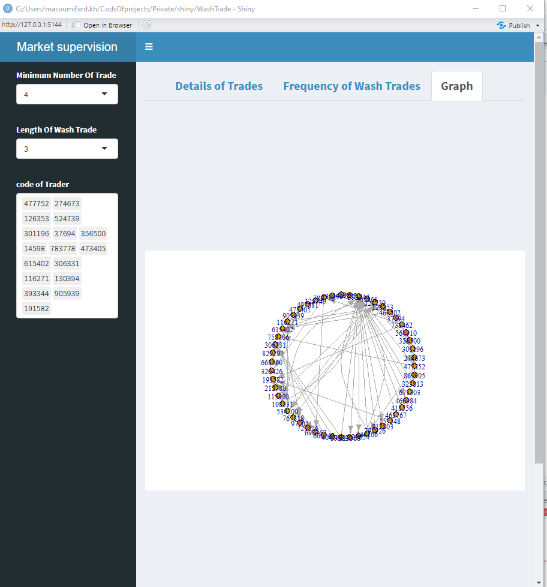

# WashTrade
My goal with this work is to identify traders who have made wash trades, i.e., some trades create a network between themselves and then trade with each other with a purpose in such a way that a cycle is formed between them. This project is not in the final version and I would be very grateful if you could add some comments to it...
## Table of Contents
* [General Info](#general-information)

<!-- * [License](#license) -->

## General Information
Stock price manipulation is a common issue, and one such case is the wash trade. In this work, we use graph theory to identify wash transactions and then create a dashboard for the results using Shiny.

