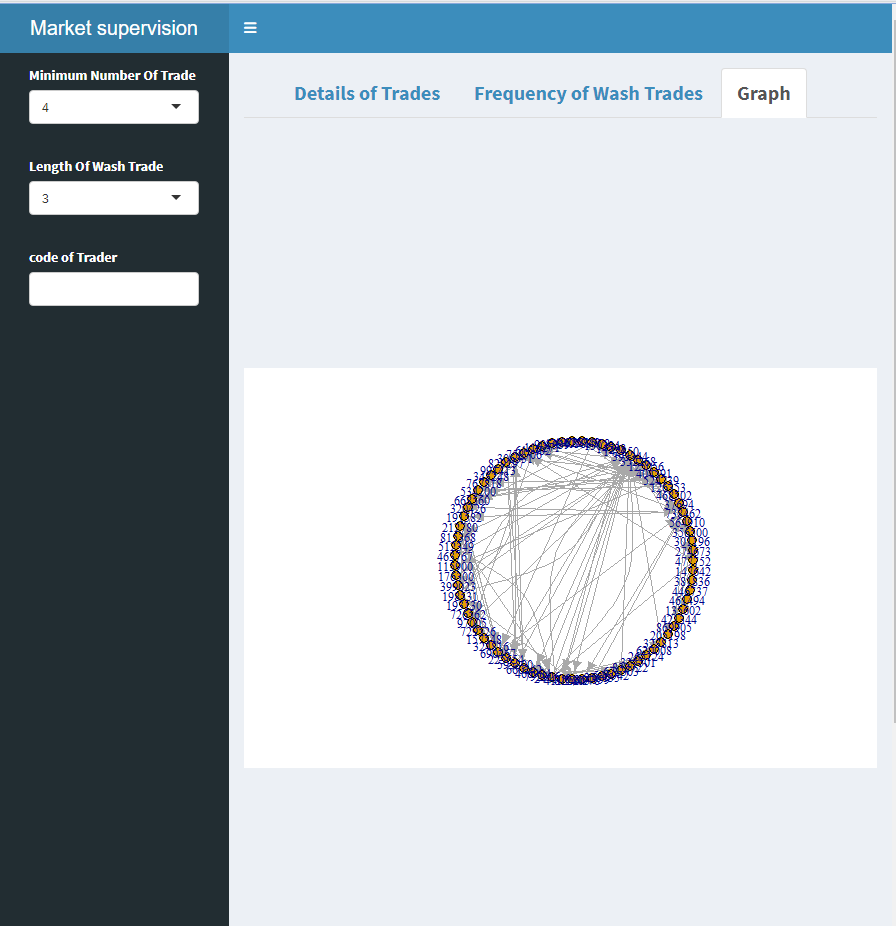

## Table of Contents
* [WashTrade](#WashTrade)
* [General Info](#general-information)
* [Code](#Code)

<!-- * [License](#license) -->

## WashTrade
My goal with this work is to identify traders who have made wash trades, i.e., some trades create a network between themselves and then trade with each other with a purpose in such a way that a cycle is formed between them. This project is not in the final version and I would be very grateful if you could add some comments to it...
## General Information
Stock price manipulation is a common issue, and one such case is the wash trade. In this work, we use graph theory to identify wash transactions and then create a dashboard for the results using Shiny.


## Code
The required library are:
```
library(shinydashboard)
library(ggplot2)
library(tidyr)
library(formattable)
library(igraph)
library(dplyr)
library("plyr")                                                 
library("readr")  
```
Read data
```
data <- read.csv("ForCharkheshi.csv")
```
UI:
```
ui <- dashboardPage(
  dashboardHeader(title = "Market supervision"),
  dashboardSidebar(
 
    fluidPage(
      selectInput("NumberOfDay", "Minimum Number Of Trade",
                  unique(c(4,8,1,2,3,5,6,7,9,10))
      ),
      selectInput("LengthOfPath", "Length Of Wash Trade",
                  unique(c(3,1,2,3,4, 5, 6))
      ),
      uiOutput("n1")
    )
    
  ),
  dashboardBody(
    # Boxes need to be put in a row (or column)
    formattableOutput("table"),
    tabsetPanel(id = "tabSelected",
                tags$style(
                  "li a {
        font-size: 20px;
        font-weight: bold;
      }
    "
                ),
              
                tabPanel("Details of Trades",
                         
                         fluidRow( 
                           DT::dataTableOutput("TotalRankingV"
                           )),
                         downloadButton("TotalRankingVD", "Download")
                       ),
                tabPanel("Frequency of Wash Trades",
                         fluidRow( 
                           DT::dataTableOutput(
                           "mytable1V")),
                        
                         fluidRow( 
                           DT::dataTableOutput("mytable2V"
                           ))
                         ),
                tabPanel("Graph",

                         fluidRow(
                            title = "Graph",
                                 plotOutput("plot2", height = 250)
                         ),
                         plotOutput("plot1", click = "plot_click"),
                         plotOutput("plot3", click = "plot_click")
                         
                )
                )
    )
)
```
Server:
```
server <- function(input, output) {
  ddd <- reactive({
    dataK = data
    from1 = sapply(dataK$CodOfSeller
                   ,
                   toString)
    
    to1 = sapply(dataK$CodOfBuyer
                 ,
                 toString)
    from1 = from1
    to1 = to1
    dataa2 = cbind(from1, to1)
    
    dataK$concat = paste0(dataK$CodOfSeller,
                          dataK$CodOfBuyer)
    ##############################
    ###############################
    Frosh2 = c()
    

    Kharid2 = c()
    
    count = c()
    
    DD = data.frame(FF = from1, Too = to1)
    from11 = DD$FF
    to11 = DD$Too
    mm = unique(DD$FF)
    for (k in 1:length(mm)){
      dataa2 = cbind(from1, to1)
      graph2 <- graph_from_edgelist(dataa2)
      Ne = neighbors(graph2, mm[k])
      for (j in 1:length(Ne)){
        a = all_simple_paths(graph2, Ne[j],mm[k], cutoff = input$LengthOfPath)
        if (length(a) > 0){
          for (i in 1:length(a)){
            tt = as_ids(a[[i]])
            
            if(length(tt) == input$LengthOfPath){
              Kharid2 = append(Kharid2, c(tt))
              Frosh2 = append(Frosh2, c(mm[k], tt[1:length(tt)-1]))
            }
          }
        }
      }
      DD = DD[DD$FF != mm[k],]
      from1 = DD$FF
      to1 = DD$Too
    }
    
    from1 = Frosh2
    from1 = from1
    to1 = Kharid2
    to1 = to1
    cONCAT = paste0(from1, to1)
    dataK[dataK$concat %in% unique(cONCAT), ]
  })
  ##########################
  output$n1 <- renderUI({
    selectInput("no1", "code of Trader", choices=unique(ddd()$CodOfSeller), multiple=T)
  })
  ##########################Rank
  output$TotalRankingV <-DT::renderDataTable({
    if(!is.null(input$no1)){
      ddd()[(ddd()$CodOfSeller %in% input$no1) | (ddd()$CodOfBuyer %in% input$no1), ]
    }else{
      ddd()
    }
  })
  output$mytable1V <-DT::renderDataTable({
    if(!is.null(input$no1)){
    ddd = ddd()[(ddd()$CodOfSeller %in% input$no1) | (ddd()$CodOfBuyer %in% input$no1), ]
    from1 = sapply(ddd$CodOfSeller
                   ,
                   toString)
    to1 = sapply(ddd$CodOfBuyer
                 ,
                 toString)
    from1 = from1
    to1 = to1
    dataa2 = cbind(from1, to1)
    ##############################
    ###############################
    Frosh2 = c()
    Kharid2 = c()
    count = c()
    DD = data.frame(FF = from1, Too = to1)
    from11 = DD$FF
    to11 = DD$Too
    mm = unique(DD$FF)
    for (k in 1:length(mm)){
      dataa2 = cbind(from1, to1)
      graph2 <- graph_from_edgelist(dataa2)
      Ne = neighbors(graph2, mm[k])
      for (j in 1:length(Ne)){
        a = all_simple_paths(graph2, Ne[j],mm[k], cutoff = input$LengthOfPath)
        if (length(a) > 0){
          for (i in 1:length(a)){
            tt = as_ids(a[[i]])
            if(length(tt) == input$LengthOfPath){
              Kharid2 = append(Kharid2, c(tt))
              Frosh2 = append(Frosh2, c(mm[k], tt[1:length(tt)-1]))
            }
          }
        }
      }
      DD = DD[DD$FF != mm[k],]
      from1 = DD$FF
      to1 = DD$Too
    }
    Dir <- data.frame(
      x1 = numeric(),
      x2 = numeric(),
      x3 = numeric(),
      x4 = numeric(),
      x5 = numeric(),
      x6 = numeric(),
      x7 = numeric(),
      x8 = numeric(),
      x9 = numeric(),
      x10 = numeric(),
      x11 = numeric(),
      x12 = numeric(),
      x13 = numeric(),
      x14 = numeric(),
      x15 = numeric(),
      x16 = numeric(),
      x17 = numeric(),
      x18 = numeric(),
      x19 = numeric())
    Cir = Dir[,c(1:(input$LengthOfPath))]
    Cir$Sum = numeric()
    Frosh22 = as.double(Frosh2)
    co= as.numeric(input$LengthOfPath)
    for (i in 1:(length(Frosh22)/co)){
      Cir[i,] = c(Frosh22[((i-1)*co+1):((i-1)*co+co)],
                       sum(Frosh22[((i-1)*co+1):((i-1)*co+co)]))
    } 
    
    USum = unique(Cir$Sum)
    NCir = Cir[Cir$Sum == USum[1],][1,]
    Fre = c(length(Cir[Cir$Sum == USum[1],]$Sum))
    for (i in 2:length(USum)){
      Fre = append(Fre,length(Cir[Cir$Sum == USum[i],]$Sum))
      NCir = rbind.fill(NCir, Cir[Cir$Sum == USum[i],][1,])
    }
    NCir$Fre = Fre
    
    NCir$Rank = rank(Fre,ties.method = "first")
    NCir
    }else{
      ddd = ddd()
      from1 = sapply(ddd$CodOfSeller
                     ,
                     toString)
      
      to1 = sapply(ddd$CodOfBuyer
                   ,
                   toString)
      from1 = from1
      to1 = to1
      dataa2 = cbind(from1, to1)
      
      ##############################
      ###############################
      Frosh2 = c()
      Kharid2 = c()
      count = c()
      DD = data.frame(FF = from1, Too = to1)
      from11 = DD$FF
      to11 = DD$Too
      mm = unique(DD$FF)
      for (k in 1:length(mm)){
        dataa2 = cbind(from1, to1)
        graph2 <- graph_from_edgelist(dataa2)
        Ne = neighbors(graph2, mm[k])
        for (j in 1:length(Ne)){
          a = all_simple_paths(graph2, Ne[j],mm[k], cutoff = input$LengthOfPath)
          if (length(a) > 0){
            for (i in 1:length(a)){
              tt = as_ids(a[[i]])
              
              if(length(tt) == input$LengthOfPath){
                Kharid2 = append(Kharid2, c(tt))
                Frosh2 = append(Frosh2, c(mm[k], tt[1:length(tt)-1]))
              }
            }
          }
        }
        DD = DD[DD$FF != mm[k],]
        from1 = DD$FF
        to1 = DD$Too
      }
      
      
      
      Dir <- data.frame(
        x1 = numeric(),
        x2 = numeric(),
        x3 = numeric(),
        x4 = numeric(),
        x5 = numeric(),
        x6 = numeric(),
        x7 = numeric(),
        x8 = numeric(),
        x9 = numeric(),
        x10 = numeric(),
        x11 = numeric(),
        x12 = numeric(),
        x13 = numeric(),
        x14 = numeric(),
        x15 = numeric(),
        x16 = numeric(),
        x17 = numeric(),
        x18 = numeric(),
        x19 = numeric())
      Cir = Dir[,c(1:(input$LengthOfPath))]
      Cir$Sum = numeric()
      Frosh22 = as.double(Frosh2)
      co= as.numeric(input$LengthOfPath)
      for (i in 1:(length(Frosh22)/co)){
        Cir[i,] = c(Frosh22[((i-1)*co+1):((i-1)*co+co)],
                    sum(Frosh22[((i-1)*co+1):((i-1)*co+co)]))
      } 
      USum = unique(Cir$Sum)
      NCir = Cir[Cir$Sum == USum[1],][1,]
      Fre = c(length(Cir[Cir$Sum == USum[1],]$Sum))
      for (i in 2:length(USum)){
        Fre = append(Fre,length(Cir[Cir$Sum == USum[i],]$Sum))
        NCir = rbind.fill(NCir, Cir[Cir$Sum == USum[i],][1,])
      }
      NCir$Fre = Fre
      
      NCir$Rank = rank(Fre,ties.method = "first")
      NCir
    }
      })
  output$plot1 <- renderPlot({
    if(!is.null(input$no1)){
      ddd = ddd()[(ddd()$CodOfSeller %in% input$no1) | (ddd()$CodOfBuyer %in% input$no1), ]
      from1 = sapply(ddd$CodOfSeller
                     ,
                     toString)
      to1 = sapply(ddd$CodOfBuyer
                   ,
                   toString)
      from1 = from1
      to1 = to1
      dataa2 = cbind(from1, to1)
      graph <- graph_from_edgelist(dataa2)
      fig <- plot(graph, layout = layout.circle, vertex.size = 8)
      fig
    }else{
    from1 = sapply(ddd()$CodOfSeller
                   ,
                   toString)
    
    to1 = sapply(ddd()$CodOfBuyer
                 ,
                 toString)
    from1 = from1
    to1 = to1
    dataa2 = cbind(from1, to1)
    
    graph <- graph_from_edgelist(dataa2)
    fig <- plot(graph, layout = layout.circle, vertex.size = 8)
    fig}
  })
}

```
```
shinyApp(ui, server)
```